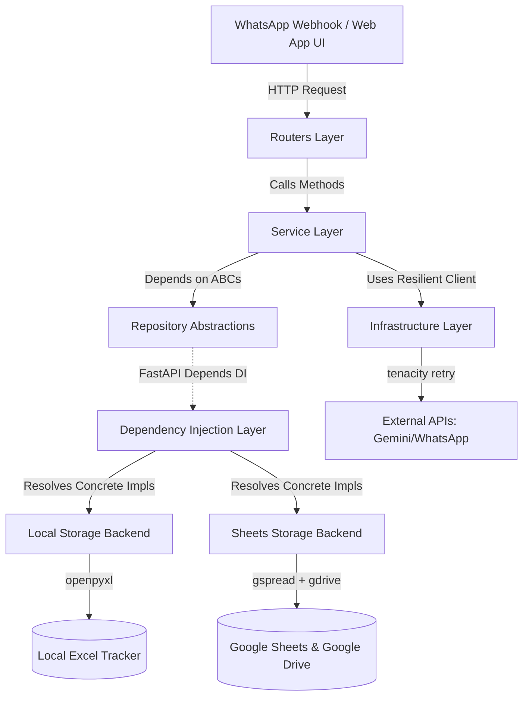

# TurboFix — SOLID Backend Architecture

This document outlines the software design and architectural specifications of the **TurboFix** backend. The system has been refactored from a monolithic script into a cleanly decoupled, testable, and highly resilient SOLID architecture tailored for free-tier pilot runs and production scale-out.

---

## 🏗️ System Components Flow

The following diagram illustrates how requests flow through the clean five-layer architecture:



---

## 📐 The 5 SOLID Principles in Action

### 1. **Single Responsibility Principle (SRP)**
Each class or module has one, and only one, reason to change.
* **Before**: `main.py` was a monolithic script routing HTTP requests, running background task loops, transcribing audio, calling OpenAI/Gemini, and directly manipulating Excel workbooks.
* **After**:
  * **HTTP Adapters**: [routers/](file:///Users/nkumarsoni/Turbobox11/backend/app/routers/) handle FastAPI serialization, request schemas, and HTTP status codes.
  * **Business Operations**: [services/](file:///Users/nkumarsoni/Turbobox11/backend/app/services/) orchestrate the workflow (e.g. parsing text, calling AI, triggering fan-out) without knowing about HTTP context.
  * **Data Access**: [repositories/](file:///Users/nkumarsoni/Turbobox11/backend/app/repositories/) handle translation between domain structures and storage cells/rows.

### 2. **Open/Closed Principle (OCP)**
Software entities are open for extension, but closed for modification.
* Adding a new storage mechanism (e.g., PostgreSQL, Firebase) does not require changing a single route handler or service. You simply implement the abstract base classes defined in [repositories/base.py](file:///Users/nkumarsoni/Turbobox11/backend/app/repositories/base.py) and update the corresponding factory function in [dependencies.py](file:///Users/nkumarsoni/Turbobox11/backend/app/dependencies.py).

### 3. **Liskov Substitution Principle (LSP)**
Subtypes must be completely substitutable for their base types.
* Both `LocalTicketRepository` and `SheetsTicketRepository` conform exactly to the [TicketRepository](file:///Users/nkumarsoni/Turbobox11/backend/app/repositories/base.py) interface. The app can swap between them at startup via environment variables (`TICKET_STORE=local` vs `sheets`) without raising runtime errors.

### 4. **Interface Segregation Principle (ISP)**
Clients should not be forced to depend on methods they do not use.
* Rather than a generic `DataStore` class mixing everything, the data layer is split into 5 client-focused repositories:
  1. [TicketRepository](file:///Users/nkumarsoni/Turbobox11/backend/app/repositories/base.py) (logs, voice notes, and AI updates)
  2. [MachineRepository](file:///Users/nkumarsoni/Turbobox11/backend/app/repositories/base.py) (technician allocations and metadata lookup)
  3. [UserRepository](file:///Users/nkumarsoni/Turbobox11/backend/app/repositories/base.py) (credentials, roles, and company quota approvals)
  4. [DocumentRepository](file:///Users/nkumarsoni/Turbobox11/backend/app/repositories/base.py) (upload/download metadata links)
  5. [PartsRepository](file:///Users/nkumarsoni/Turbobox11/backend/app/repositories/base.py) (spare parts and consumables inventory tracking)

### 5. **Dependency Inversion Principle (DIP)**
High-level modules should not depend on low-level modules; both should depend on abstractions.
* Routers and Services never import [local/ticket_repo.py](file:///Users/nkumarsoni/Turbobox11/backend/app/repositories/local/ticket_repo.py) or [sheets/ticket_repo.py](file:///Users/nkumarsoni/Turbobox11/backend/app/repositories/sheets/ticket_repo.py) directly.
* They import and request the abstract interfaces defined in [repositories/base.py](file:///Users/nkumarsoni/Turbobox11/backend/app/repositories/base.py). FastAPI's `Depends()` resolver binds the concrete implementations dynamically.

---

## 🗂️ Architectural Directory Breakdown

### 1. **Routers Layer (`app/routers/`)**
Thin HTTP entry points that map REST paths to service actions:
* [webhook_router.py](file:///Users/nkumarsoni/Turbobox11/backend/app/routers/webhook_router.py): WhatsApp Cloud API entry point. Validates Meta handshakes and receives text/audio payloads.
* [auth_router.py](file:///Users/nkumarsoni/Turbobox11/backend/app/routers/auth_router.py): Handles signup, JWT login, and secure email-based password resets.
* [vault_router.py](file:///Users/nkumarsoni/Turbobox11/backend/app/routers/vault_router.py): Serves CRUD for machines, documents, spare parts, and consumables.
* [dashboard_router.py](file:///Users/nkumarsoni/Turbobox11/backend/app/routers/dashboard_router.py): Fetches company-specific KPI trends.
* [admin_router.py](file:///Users/nkumarsoni/Turbobox11/backend/app/routers/admin_router.py): Platform portal for company approval and quota allocations.

### 2. **Service Layer (`app/services/`)**
The orchestrator of domain business logic:
* [ticket_service.py](file:///Users/nkumarsoni/Turbobox11/backend/app/services/ticket_service.py): Handles text message parser dispatch, voice-note media downloads, transcription coordination, and asynchronous background tasks.
* [ai_service.py](file:///Users/nkumarsoni/Turbobox11/backend/app/services/ai_service.py): Provider-agnostic AI client wrapper (defaults to Google Gemini Free Tier).
* [fanout_service.py](file:///Users/nkumarsoni/Turbobox11/backend/app/services/fanout_service.py): Gathers technicians and managers assigned to a machine and fires WhatsApp alert templates.
* [vault_service.py](file:///Users/nkumarsoni/Turbobox11/backend/app/services/vault_service.py): Validates file sizes/extensions and delegates manual/diagram uploads to Google Drive or local disks.
* [dashboard_service.py](file:///Users/nkumarsoni/Turbobox11/backend/app/services/dashboard_service.py): Computes live metrics (e.g. plant health %, MTTR hours to fix, weekly trends) on ticket sets.

### 3. **Repository Layer (`app/repositories/`)**
Contains storage-agnostic data mappings:
* [base.py](file:///Users/nkumarsoni/Turbobox11/backend/app/repositories/base.py): Holds pure schemas, constants, and abstract interfaces.
* [local/](file:///Users/nkumarsoni/Turbobox11/backend/app/repositories/local/): `openpyxl` bindings reading/writing `TurboFix-Tracker.xlsx` directly. Contains a path-keyed memory cache to minimize file-lock reading.
* [sheets/](file:///Users/nkumarsoni/Turbobox11/backend/app/repositories/sheets/): `gspread` bindings connecting to a live Google Sheet.
  * [client.py](file:///Users/nkumarsoni/Turbobox11/backend/app/repositories/sheets/client.py): Thread-safe cached singleton manager for the `gspread.Client` to avoid token exhaustion.

### 4. **Infrastructure Layer (`app/infrastructure/`)**
Handles external connections and cross-cutting utility concerns:
* [http_client.py](file:///Users/nkumarsoni/Turbobox11/backend/app/infrastructure/http_client.py): Resilient HTTP requests wrapping `httpx` with `tenacity` retries. Transient network/rate errors (429, 500, 502, 503, 504) trigger exponential backoff.
* [file_storage.py](file:///Users/nkumarsoni/Turbobox11/backend/app/infrastructure/file_storage.py): Decoupled storage for uploads. Combines ephemeral local disk storage (for development) and a Google Drive API backend (for production, ensuring files survive container rebuilds on platforms like Railway).
* [logging.py](file:///Users/nkumarsoni/Turbobox11/backend/app/infrastructure/logging.py): Centralized structured JSON logging via `structlog`. All events output searchable keys (e.g. `ticket_id`, `company_code`, `elapsed_ms`) ready for Railway's log indexers.

---

## 🔧 Environment Configuration Matrix

The DI factory selects the appropriate repository engine automatically using environment variables:

| Environment Variable | Local Dev (`local`) | Production (`sheets`) | Description |
|----------------------|-------------------|----------------------|-------------|
| `TICKET_STORE` | `local` | `sheets` | Backing engine for ticket data |
| `DOCUMENT_STORE` | `local` | `drive` | Backing engine for document files |
| `TRACKER_XLSX_PATH` | `./TurboFix-Tracker.xlsx` | *(Not Used)* | Local Excel filepath |
| `GOOGLE_SERVICE_ACCOUNT_FILE` | *(Not Used)* | `google-key.json` | Credential JSON file path |
| `GOOGLE_SHEET_ID` | *(Not Used)* | `1F6A8v5ufFN...` | Target spreadsheet ID |
| `GOOGLE_DRIVE_FOLDER_ID` | *(Not Used)* | `1a2b3c4d5e...` | Target Drive folder ID |

---

## 🧪 Testability Scaffolding

Thanks to Dependency Inversion, the application is extremely simple to test. The test suite mock-patches configuration settings and cleans up factory caching instantly in [conftest.py](file:///Users/nkumarsoni/Turbobox11/backend/tests/conftest.py):

```python
# Clear the cache to prevent test pollution
from app import dependencies
dependencies.get_tickets.cache_clear()
```

Routes can be tested with standard mock engines without making active connections to Google or Meta servers.

---

## 🛡️ INCOSE Systems Engineering Framework

Applying the **INCOSE Systems Engineering** methodology ensures that every physical and digital interface is controlled, every requirement is traceable to a specific system component, and all operational risks are mitigated.

### 1. Requirements Traceability Matrix (RTM)

| Req ID | User Requirement | System Feature | Implementation Component | Verification Method |
| :--- | :--- | :--- | :--- | :--- |
| **REQ-001** | Zero-App Onboarding | Scan machine QR code to open pre-filled WhatsApp chat | [qr-generator.html](file:///Users/nkumarsoni/Turbobox11/qr-generator.html) | Manual scanner verification |
| **REQ-002** | Voice Note Ticketing | Transcribe and summarize voice note into an actionable issue brief | [ai_service.py](file:///Users/nkumarsoni/Turbobox11/backend/app/services/ai_service.py) | Unit tests in [test_gemini.py](file:///Users/nkumarsoni/Turbobox11/backend/tests/test_gemini.py) |
| **REQ-003** | Automated Fan-Out | Notify assigned technician and managers on ticket log | [fanout_service.py](file:///Users/nkumarsoni/Turbobox11/backend/app/services/fanout_service.py) | Mock tests in [test_fanout.py](file:///Users/nkumarsoni/Turbobox11/backend/tests/test_fanout.py) |
| **REQ-004** | Ephemeral Immunity | Document files must survive backend container rebuilds | [file_storage.py](file:///Users/nkumarsoni/Turbobox11/backend/app/infrastructure/file_storage.py) (Drive implementation) | Endpoint tests in [test_vault_documents.py](file:///Users/nkumarsoni/Turbobox11/backend/tests/test_vault_documents.py) |
| **REQ-005** | Multi-tenant Isolation | Restrict owners and supervisors from seeing other companies' dashboard KPIs | [dashboard_router.py](file:///Users/nkumarsoni/Turbobox11/backend/app/routers/dashboard_router.py) (JWT scoping) | Scoped test client queries |

### 2. Failure Mode and Effects Analysis (FMEA)

| Subsystem / Function | Failure Mode | Local Effect | System Effect | Mitigation Mechanism |
| :--- | :--- | :--- | :--- | :--- |
| **AI Transcription / Triage** | OpenAI or Gemini API returns 429 Rate Limit or 503 Outage | `ai_service` raises HTTP exception | AI brief is blank; ticket logging is delayed or blocked | **Tenacity Retry Policy**: Automatically retries 3 times with exponential backoff. Swallows final exception so ticket logs normally with blank AI brief rather than dropping the webhook. |
| **WhatsApp Media Downloader** | Media ID lookup returns 404 (Meta side latency) | Audio download fails | Ticket description remains default placeholder | **Session Sweep Task**: Background loop sweeps orphaned/unnotified sessions every 60s, triggering a fallback raw text fan-out so technicians are never left in the dark. |
| **Google Sheets Database** | gspread client times out due to concurrent read/write locks | Data write fails | Ticket/Machine update fails | **gspread Session Caching**: In-process path cache prevents redundant Sheet queries; HTTP clients retry transient errors. |
| **File Storage Upload** | User uploads 50MB manual | Drive API returns size error / memory overflow | App crashes or locks up thread | **File Validation Gate**: Validates filename extensions and limits maximum file uploads to 25MB before executing target Drive API streams. |

